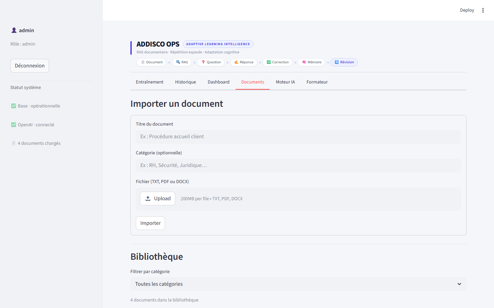
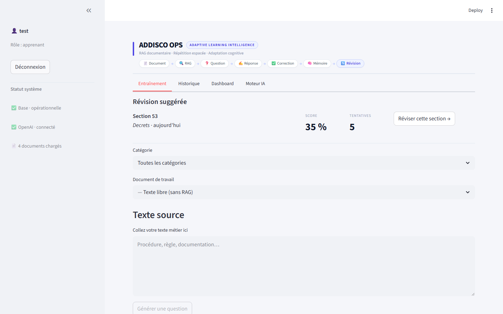
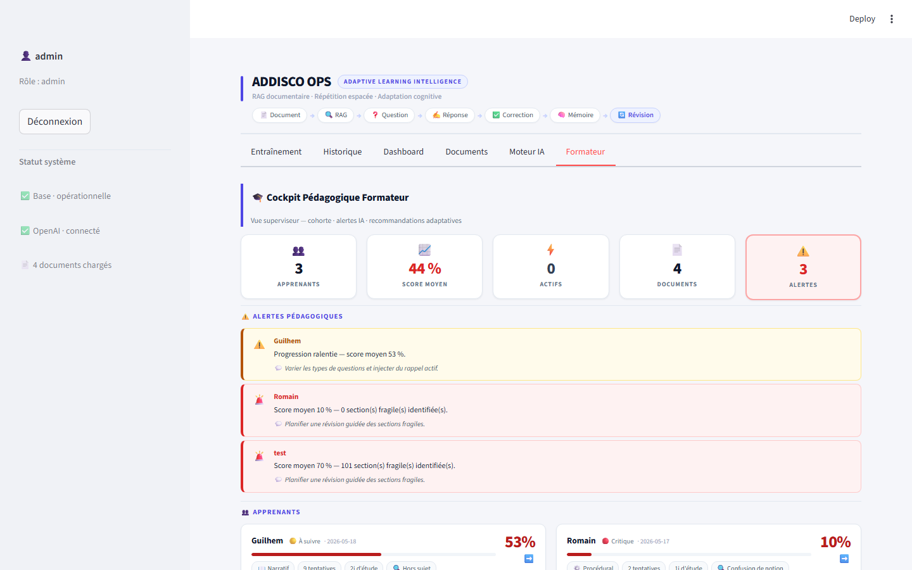
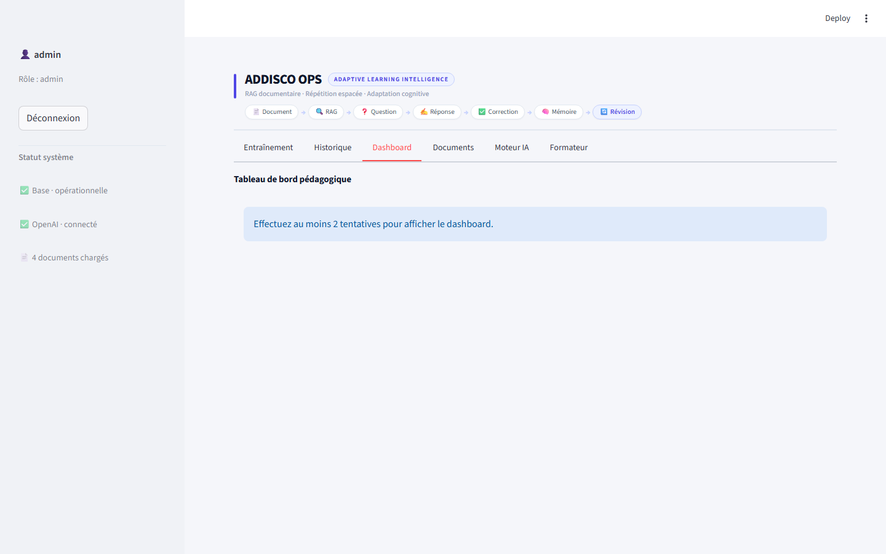
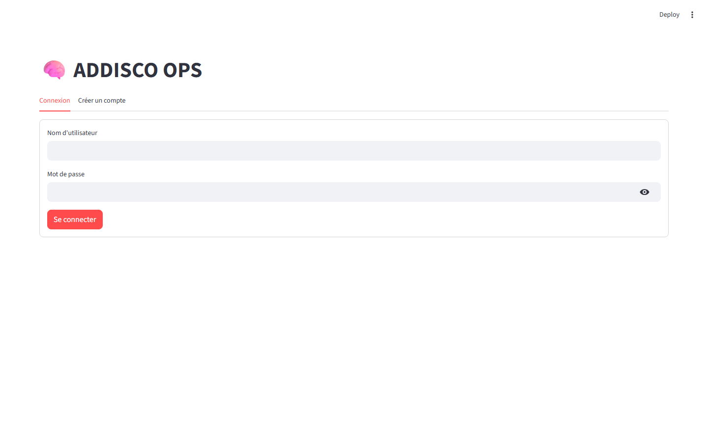
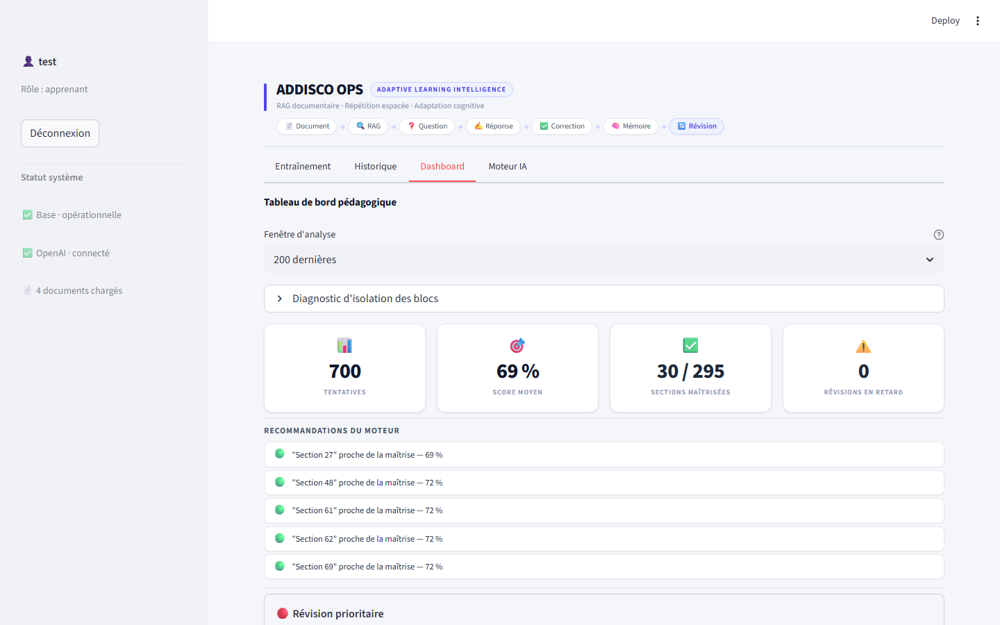
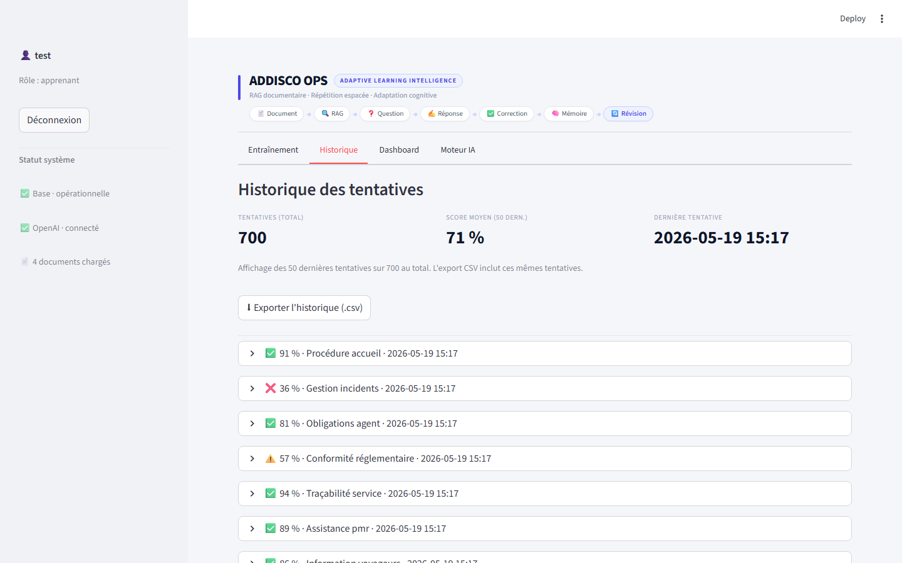
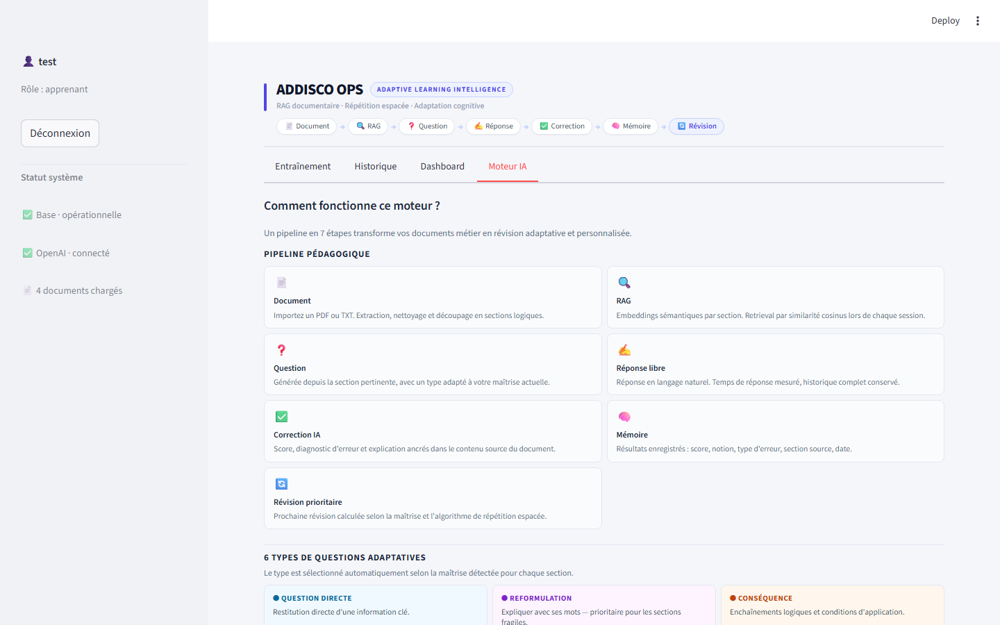

# ADDISCO OPS — Moteur de révision pédagogique par IA

Plateforme de formation professionnelle basée sur un corpus documentaire,
la génération de questions par IA et la correction adaptative.

---

## Présentation

### Problématique

Les équipes opérationnelles doivent maîtriser des procédures, des réglementations
et des protocoles en constante évolution. Les formations classiques (PDF, présentiel,
e-learning statique) produisent des connaissances fragiles qui s'érodent rapidement.

### Vision ADDISCO OPS

ADDISCO OPS est un moteur de révision pédagogique qui permet à une organisation
d'importer ses propres documents (procédures internes, référentiels métier, réglementations)
et de générer automatiquement des sessions de révision personnalisées pour ses collaborateurs.

Le moteur adapte la pédagogie à chaque apprenant : type de question, niveau de difficulté,
rythme de révision et priorité des notions fragiles évoluent selon les résultats observés.

### Objectif du moteur

Transformer un corpus documentaire statique en un système de révision vivant,
capable de détecter les lacunes individuelles et d'y apporter une réponse pédagogique ciblée.

---

## Fonctionnalités actuelles

### Gestion documentaire

| Fonctionnalité | État |
|---|---|
| Import PDF | Stable |
| Import DOCX | Stable |
| Import texte brut | Stable |
| Découpage en chunks sémantiques | Stable |
| Calcul d'embeddings (OpenAI text-embedding-3-small) | Stable |
| Catégorisation des documents | Stable |
| Corpus multi-documents | Stable |


*Upload PDF / DOCX / TXT, catégorisation par domaine, statut de chunking et d'indexation des embeddings.*

### Moteur pédagogique

| Fonctionnalité | État |
|---|---|
| Génération de questions (6 types) | Stable |
| Correction IA structurée (score + type d'erreur) | Stable |
| Recherche contextuelle RAG | Stable |
| Recherche cross-documents | Stable |
| Fallback texte brut si RAG indisponible | Stable |
| Historique des tentatives par utilisateur | Stable |
| Répétition espacée (intervalles adaptatifs) | Stable |

Les 6 types de questions générés : question directe, cas pratique, vrai/faux,
question pièges, reformulation, question de conséquence.


*Session d'entraînement : question générée par RAG, contexte du chunk source, zone de réponse et correction après soumission.*

### Profils d'apprentissage et analytics

| Fonctionnalité | État |
|---|---|
| Profil pédagogique par utilisateur | Stable |
| Score par dimension (logique, procédural, narratif, analogique) | Stable |
| Détection des notions fragiles | Stable |
| Momentum (progression sur 7 jours) | Stable |
| Learning velocity (delta de score inter-sessions) | Stable |
| Consistency score (régularité des sessions) | Stable |
| Métriques de rétention J+1 / J+7 / J+30 | Stable (données requises) |
| Plan de session adaptatif | Stable |

### Dashboard et interface

| Fonctionnalité | État |
|---|---|
| Dashboard apprenant — progression, scores, notions fragiles | Stable |
| Dashboard formateur — cockpit pédagogique de cohorte | Partiel (voir § État actuel) |
| Historique paginé des tentatives | Stable |
| Contexte RAG affiché pendant l'entraînement | Stable |
| Alertes pédagogiques automatiques | Stable |

### Gestion des utilisateurs et rôles

| Fonctionnalité | État |
|---|---|
| Authentification par compte (bcrypt) | Stable |
| Rôles : apprenant / formateur / admin | Stable |
| Inscription publique limitée au rôle apprenant | Stable |
| Promotion de rôle via interface admin | Stable |
| Outils CLI admin (création, reset mot de passe) | Stable |

### Qualité et observabilité

| Fonctionnalité | État |
|---|---|
| Suite de tests unitaires | 227 tests |
| Script de robustesse 100 questions simulées | Stable |
| Audit empirique des skills (read-only) | Stable |
| Séparation runtime / tooling | Stable |

---

## Architecture générale

### Pipeline documentaire et pédagogique

```
Document (PDF / DOCX / TXT)
        │
        ▼
  document_service.py
  Extraction + nettoyage du texte
        │
        ▼
  Découpage en chunks (~500 caractères, par section logique)
        │
        ▼
  ai_service.py
  Calcul des embeddings (OpenAI text-embedding-3-small, 1 536 dims)
  Stockage BLOB float32 en SQLite
        │
        ▼
  ─────────────── Session d'entraînement ───────────────
        │
        ▼
  rag_service.py
  Recherche cosinus — top-K chunks les plus pertinents
        │
        ▼
  ai_service.py
  Génération de question (gpt-4o-mini)
  Type pédagogique sélectionné selon le profil utilisateur
        │
        ▼
  Réponse de l'apprenant
        │
        ▼
  ai_service.py
  Correction structurée : score (0–1), type d'erreur, notion
        │
        ▼
  database.py
  Enregistrement de la tentative (attempt)
  chunk_id préservé pour la répétition espacée
        │
        ▼
  adaptive_engine.py
  Mise à jour du profil d'apprentissage
  Calcul des prochaines révisions (intervalles espacés)
        │
        ▼
  Dashboard — analytics, notions fragiles, progression
```

### Moteur adaptatif

```
Tentatives (score, type_erreur, pedagogy_type, chunk_id)
        │
        ▼
  classify_mastery()
  → débutant / intermédiaire / maîtrisé / fragile (par chunk)
        │
        ▼
  _choose_question_type()
  → rotation + biais mastery + profil pédagogique utilisateur
        │
        ▼
  Question typée → Correction → Profil mis à jour
```

---

## Structure du projet

```
addisco-ops/
│
├── app.py                    — Routeur Streamlit (auth, sidebar, navigation)
├── auth_service.py           — Authentification bcrypt, gestion des rôles
├── database.py               — Couche SQLite (tentatives, profils, documents)
├── ai_service.py             — RAG, embeddings, génération, correction (OpenAI)
├── rag_service.py            — Recherche vectorielle cosinus (numpy)
├── adaptive_engine.py        — Moteur pur (zéro dépendance projet)
├── document_service.py       — Import, chunking, seed démo
├── logger.py                 — Logging centralisé
│
├── tabs/                     — Onglets Streamlit
│   ├── tab_training.py       — Session d'entraînement
│   ├── tab_dashboard.py      — Analytics et profil
│   ├── tab_documents.py      — Import et gestion des documents
│   ├── tab_history.py        — Historique des tentatives
│   ├── tab_trainer.py        — Cockpit formateur
│   └── tab_engine.py         — Paramètres moteur
│
├── db/                       — Sous-modules base de données
│   ├── admin.py              — Gestion utilisateurs
│   ├── analytics.py          — Requêtes analytics
│   ├── chunks.py             — Accès aux chunks
│   ├── profile.py            — Profil d'apprentissage
│   └── skills.py             — Moteur de compétences
│
├── engine/                   — Modules du moteur adaptatif
│   ├── spaced_rep.py         — Répétition espacée
│   ├── question_type.py      — Sélection du type pédagogique
│   ├── profile_metrics.py    — Momentum, velocity, consistency
│   ├── retention.py          — Métriques de rétention
│   └── session_plan.py       — Plan de session personnalisé
│
├── tools/                    — Outils internes (jamais importés par le runtime)
│   ├── admin/
│   │   ├── create_admin.py   — CLI : créer un compte admin
│   │   └── reset_password.py — CLI : réinitialiser un mot de passe
│   ├── qa/
│   │   └── test_robustesse_100q.py — Test 100 cycles simulés
│   └── observability/
│       └── audit_skills_empirique.py — Audit read-only des compétences
│
├── README.md                 — Ce fichier
├── README_DEV.md             — Comptes de test, outils CLI, règles admin
├── ARCHITECTURE.md           — Architecture technique détaillée
├── ROADMAP.md                — Phases et tâches du projet
└── DEVLOG.md                 — Journal de développement chronologique
```

---

## Système de rôles

### Apprenant

- Accès à son espace d'entraînement personnel.
- Sélectionne les documents sur lesquels s'entraîner.
- Consulte son dashboard de progression et son historique.
- Voit ses notions fragiles et ses alertes pédagogiques.

### Formateur

- Importe et gère les documents du corpus.
- Accède au cockpit pédagogique de cohorte.
- Suit la progression des apprenants (scores, profils, alertes).


*Cockpit pédagogique formateur : vue cohorte, alertes pédagogiques par apprenant, scores moyens et indicateurs de progression.*

### Administrateur

- Gère les comptes utilisateurs et les promotions de rôle.
- Supervise les documents et les statistiques globales.
- Accède aux outils CLI d'administration (création de compte, reset de mot de passe).


*Vue administrateur : tableau de bord avec métriques globales de la plateforme et navigation multi-onglets.*

> La création de comptes administrateurs est réservée aux scripts CLI (`tools/admin/`).
> L'inscription publique est limitée au rôle `apprenant`.


*Formulaire de connexion — onglets Connexion / Créer un compte. L'inscription publique crée automatiquement un compte apprenant.*

---

## Analytics pédagogiques

### Profil détecté

À chaque session, le moteur calcule pour chaque utilisateur :

- **Dimension dominante** : logique / procédurale / narrative / analogique
  (selon les types de questions auxquels l'utilisateur répond le mieux)
- **Notions fragiles** : topics sur lesquels le score est systématiquement bas
- **Momentum** : tendance de progression sur les 7 derniers jours
- **Learning velocity** : delta de score moyen entre sessions
- **Consistency score** : régularité des connexions sur 30 jours


*Tableau de bord apprenant : score global, sections maîtrisées, révisions en retard et recommandations du moteur adaptatif.*

### Répétition espacée

Les chunks (passages de document) sont classés par niveau de maîtrise :
`débutant`, `intermédiaire`, `maîtrisé`, `fragile`.

Les intervalles de révision s'adaptent automatiquement :
un chunk fragile est reproposé rapidement, un chunk maîtrisé revient plus tard.


*Historique des tentatives : question, réponse, score, type d'erreur et notion — données sources des calculs de répétition espacée.*

### Métriques de rétention

Le moteur calcule des taux de rétention à J+1, J+7 et J+30 par chunk et par utilisateur.
Ces métriques nécessitent un volume suffisant de tentatives pour être interprétables.

### Alertes pédagogiques

Des alertes automatiques signalent : stagnation du score, notion récurrente en échec,
absence prolongée, déséquilibre dans la couverture du corpus.

---

## Observabilité et qualité

### Tests automatisés

```bash
python -m pytest test_auth_service.py test_regression.py -v
# 227 tests — couverture : auth, RAG, analytics, répétition espacée, profils
```

### Test de robustesse pédagogique

Simule 100 cycles complets (génération → correction → sauvegarde → profil) sans appel API.

```bash
python tools/qa/test_robustesse_100q.py --mock --no-confirm
# Verdict : GO SAFE | GO WITH WARNING | FAILED
```

### Audit des compétences

Analyse read-only du Skills Engine : couverture, mastery, discrimination, patterns émergents.

```bash
python tools/observability/audit_skills_empirique.py --username test
```

### Séparation runtime / tooling

Le dossier `tools/` contient uniquement des scripts CLI internes.
Aucun fichier de `tools/` n'est importé par le runtime applicatif.
Cette séparation garantit que les outils de diagnostic ne peuvent pas
affecter le comportement de l'application en production.


*Onglet Moteur IA : métriques de rétention, répartition des types d'erreurs et mastery par compétence.*

---

## État actuel du projet

### Ce qui est stable et démontrable

- Authentification multi-utilisateur avec rôles (bcrypt)
- Import de documents (PDF, DOCX, TXT) et génération d'embeddings
- Pipeline RAG complet — recherche sémantique cross-documents
- Génération de questions (6 types) et correction structurée par IA
- Répétition espacée avec intervalles adaptatifs
- Historique complet des tentatives par utilisateur
- Dashboard apprenant avec analytics et alertes
- Profil d'apprentissage (dimensions pédagogiques, notions fragiles, momentum)
- Outils admin et QA (CLI, tests, audit)

### Ce qui est en mode démonstrateur ou partiel

- **Cockpit formateur** : les métriques de cohorte sont fonctionnelles mais certains
  indicateurs (comparaison inter-apprenants) s'appuient sur des données simulées
  tant que la cohorte réelle est réduite.
- **Skills Engine V1.0** : le mapping chunks → compétences est déterministe par mots-clés,
  pas par apprentissage automatique. Les compétences détectées dépendent du référentiel
  défini manuellement.
- **Métriques de rétention J+7 / J+30** : calculables dès le démarrage, mais interprétables
  seulement après plusieurs semaines d'usage réel.
- **Plan de session adaptatif** : calculé par le moteur, l'intégration dans le flux principal
  de l'interface apprenant est prévue en Phase 16.

### Ce qui est prévu

- Vue admin complète (gestion utilisateurs, activation/désactivation, stats globales)
- Rapport PDF hebdomadaire par apprenant
- Interface responsive (tablette, mode présentation)
- Skills Engine V2 : cartographie des compétences assistée par LLM
- PostgreSQL + pgvector en production
- Docker et CI/CD complet

---

## Parcours utilisateur type

```
Administrateur
  │  Crée les comptes ou promeut un apprenant en formateur / admin
  │  (via l'interface admin ou les outils CLI tools/admin/)
  ▼
Formateur
  │  Importe les documents du corpus (PDF, DOCX, TXT)
  │  Catégorise les documents par domaine métier
  ▼
Documents → Chunks → Embeddings
  │  Le moteur découpe et indexe automatiquement
  ▼
Apprenant
  │  Sélectionne un document ou le corpus complet
  │  Répond aux questions générées par le moteur RAG
  ▼
Moteur pédagogique
  │  Corrige la réponse, attribue un score et un type d'erreur
  │  Enregistre la tentative avec le chunk source (répétition espacée)
  ▼
Skills / Mastery
  │  Met à jour la maîtrise par compétence et par chunk
  │  Calcule le profil pédagogique, le momentum, les fragilités
  ▼
Dashboard apprenant + cockpit formateur
     Analytics, alertes, progression, plan de révision
```

---

## Ce que montre la démonstration

1. **Transformation documentaire** — un document PDF ou DOCX importé devient en quelques secondes
   une source de questions contextualisées, sans configuration manuelle.

2. **RAG en action** — chaque question est ancrée dans un passage précis du document,
   visible par l'apprenant pendant la session d'entraînement.

3. **Correction structurée** — la réponse est évaluée par le LLM avec un score (0–1),
   un type d'erreur catégorisé et une explication pédagogique.

4. **Répétition espacée** — les passages sur lesquels un apprenant échoue
   reviennent plus fréquemment ; les passages maîtrisés s'espacent progressivement.

5. **Détection des fragilités** — le moteur identifie automatiquement les notions
   sur lesquelles le score est systématiquement bas et les signale dans le dashboard.

6. **Analytics pédagogiques** — progression dans le temps, répartition par type d'erreur,
   dimensions pédagogiques dominantes, momentum sur 7 jours : tout est calculé localement,
   sans service externe.

7. **Séparation des rôles** — un apprenant voit uniquement son espace ;
   un formateur voit le cockpit de cohorte ; un admin gère les comptes et les documents.

8. **Outils QA et audit** — le projet inclut un test de robustesse 100 questions simulées
   et un audit read-only des compétences, exécutables en ligne de commande à tout moment.

---

## Démonstration visuelle

Les captures sont intégrées dans les sections correspondantes du document.
Les fichiers sont disponibles dans [`docs/assets/`](docs/assets/).

| Capture | Section | Description |
|---|---|---|
| `login.png` | Système de rôles | Formulaire de connexion |
| `session_entrainement.png` | Moteur pédagogique | Session d'entraînement |
| `dashboard_apprenant.png` | Analytics pédagogiques | Tableau de bord apprenant |
| `historique.png` | Répétition espacée | Historique des tentatives |
| `analytics.png` | Observabilité | Onglet Moteur IA |
| `import_documents.png` | Gestion documentaire | Import de documents |
| `dashboard_formateur.png` | Système de rôles / Formateur | Cockpit pédagogique |
| `admin_roles.png` | Système de rôles / Admin | Dashboard administrateur |

---

## Limites actuelles assumées

- **Interface Streamlit** : l'interface est fonctionnelle et démontrable, mais reste une interface
  MVP. Elle n'a pas été conçue pour un déploiement multi-utilisateurs concurrent à grande échelle.

- **Base de données SQLite** : la base locale est adaptée au développement, aux démonstrations
  et aux petites cohortes. La migration vers PostgreSQL est prévue en Phase 17, conditionnée
  à la disponibilité d'un hébergeur cible.

- **Cockpit formateur** : certains indicateurs de comparaison inter-apprenants s'appuient
  sur des données simulées tant que la cohorte réelle est inférieure à un seuil significatif.

- **Skills Engine V1.0** : le mapping chunks → compétences est déterministe par mots-clés.
  Il produit des résultats exploitables sur un corpus structuré, mais ne constitue pas
  un moteur d'inférence de compétences par apprentissage automatique.

- **Docker / CI/CD / monitoring** : non encore mis en place. L'application se lance
  localement via `streamlit run app.py`. La conteneurisation est planifiée en Phase 17.

---

## Lancement local

### Prérequis

- Python 3.10+
- Clé API OpenAI (modèles `gpt-4o-mini` et `text-embedding-3-small`)

### Installation

```bash
# Cloner le dépôt
git clone <url-du-repo>
cd addisco-ops

# Créer et activer l'environnement virtuel
python -m venv .venv

# Windows
.venv\Scripts\activate
# macOS / Linux
source .venv/bin/activate

# Installer les dépendances
pip install -r requirements.txt
```

### Configuration

```bash
# Copier le fichier d'environnement
cp .env.example .env

# Renseigner votre clé OpenAI dans .env
OPENAI_API_KEY=sk-...
```

### Démarrage

```bash
streamlit run app.py
```

L'application s'ouvre dans le navigateur. Au premier lancement, elle propose
un seed de documents de démonstration.

### Comptes de démonstration

| Username | Mot de passe | Rôle |
|---|---|---|
| `admin` | `admin123` | Administrateur |
| `test` | `test123` | Apprenant |

---

## Roadmap future

### Phase 16 — Interface professionnelle complète

- Vue admin : gestion des utilisateurs depuis l'interface (activation, désactivation)
- Rapport PDF automatique par apprenant (bilan hebdomadaire)
- Layout responsive optimisé tablette

### Phase 17 — Production industrielle

- **Docker** : conteneurisation complète, déploiement en une commande
- **PostgreSQL** : base de données scalable avec SQLAlchemy Core
- **pgvector** : recherche sémantique cosinus native, indexée
- **Alembic** : migrations versionnées et réversibles
- **CI/CD** : tests automatiques à chaque commit, déploiement sur push `main`
- **Monitoring** : remontée d'erreurs production, métriques d'usage (latence, taux d'erreur)
- **Rate limiting** : protection des appels LLM par utilisateur

### Évolutions pédagogiques prévues

- Skills Engine V2 : cartographie des compétences assistée par LLM
- Guardrails architecture : validation automatique du pipeline pédagogique
- Observabilité avancée : tableau de bord qualité en temps réel
- Moteur adaptatif V2 : prise en compte des patterns de progression multi-sessions

---

## Stack technique

| Composant | Technologie |
|---|---|
| Interface | Streamlit |
| LLM | OpenAI gpt-4o-mini |
| Embeddings | OpenAI text-embedding-3-small (1 536 dims) |
| Base de données | SQLite (sqlite3 stdlib) |
| Recherche vectorielle | numpy — similarité cosinus |
| Authentification | bcrypt |
| Tests | unittest / pytest |
| Langage | Python 3.10+ |

---

*ADDISCO OPS — Projet en développement actif — Phase 16 en cours*
